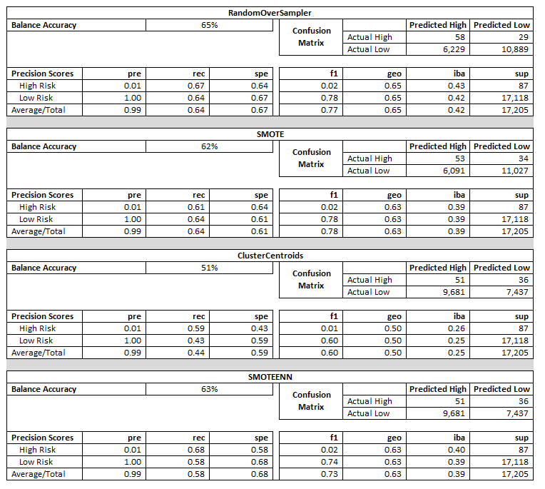
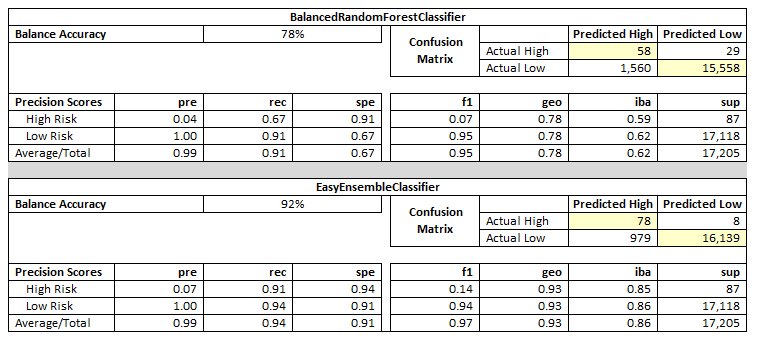

# Credit Risk Analysis - Supervised Machine Learning

## Overview
Fast Lending, a peer-to-peer lending services company wants to use machine learning to predict credit risk. The leaders believe that this will provide a quicker and more reliable loan experience. The assumption is that supervised machine learning will lead to a more accurate identification of good candidates for loans and further lead to lower default rates.

We were asked to build and evaluate several models, or algorithms, to predict credit risk. The process used sampling and ensemble learners to ensure accuracy of the analysis. The models also included a large set of data where that should assist in quickly making a single decision, approval or denial of the requested loan.

The analysis includes several different models using them to compare the strengths and weaknesses of the models. Python and Sciket-learn were utilized in the process to build and evaluate the data and predict credit risk.

 
## Results
A very large data set was utilized to create the machine learning tool.  The data was first divided into a training and testing set so that we are able to test the accuracy of the model.  Once the data was split sampling models were used to analyze the data utilizing:

* Oversampling by using the RandomOverSampler and SMOTE algorithms.
* Undersampling by using the ClusterCentroids algorithm.
* Over/Undersampling using the SMOTEENN algorithm.
* Finally, compare two machine learning models that should reduce bias, BalancedRandomForestClassifier and EasyEnsembleClassifier.

*Sampling*

* Balance Accuracy Score for all four models is low ranging from 51% to 65%.
* The Confusion Matrix for the ClusterCentroids and SMOTEENN models were less accurate than the RandomOverSampler and SMOTE models for low-risk customers with accurate results of 7,737 compared to 10,000+ on the other two models. The results for high-risk customers were comparable across all four models with ~50 that were predicted to be high-risk and were high-risk.
* Precision Scores is similar across all models for high-risk customers at 1% and low risk customers at 100%. This is interesting when comparing to the f1 score as the models are all comparable to each other except for ClusterCentroids. The low-risk customers are at 60% on the ClusterCentroids with the other models at a 70%+ range.
 

*Ensemble*
   

* The Confusion Matrix results for the ensemble models are not comparable to the other models with a higher accuracy than the resampling models, which is also evident in the Balance Accuracy scores at 78% for the BalancedRandomForestClassifier and 92% for the EasyEnsembleClassifier.
* The Precision Scores for these models are similar to the other models; however, a little better for the high-risk loans. The f1 scores for these models are better with an average of 95% and 97%, respectively.

## Summary
While the Balance Accuracy scores are low for four of the six models this is not necessarily a negative outcome, but it does show that the lower models would reject a large number of customers that would actually be a good risk for the bank. Should the bank choose to use the more restrictive models they would need to understand that there might be missed opportunities for the bank. They would also need to weigh the risks of the Ensemble models to see if funding a larger number of loans would be financially feasible.

It is recommended that Fast Lending utilize the EasyEnsembleClassifier model as it would conceivably only reject a small number of low-risk customers and approve an even smaller number of high-risk customers.
