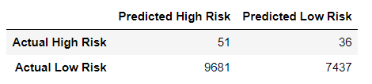

# Credit Risk Analysis - Machine Learning

## Overview
 Fast Lending, a peer to peer lending services company wants to use machine learning to predict credit risk.  The leaders believe that this will provide a quicker and more reliable loan experience.  The assumption is that supervised machine learning will lead to a more accurate indentification of good candidates for loans and further lead to lower default rates.  
 
 We were asked to build and evaluate several models, or algorithims, to predict credit risk.  The process used sampling and ensemble learners to ensure accuracy of the analysis.  The models also included a large set of data where that should assist in quickly making a single decision, approval or denial of the requested loan.  
 
 The analysis includes several different models using them to compare the strengths and weaknesses of the models.  Python and Sciket-learn werea utilized in the process to build and evaluate the data and predict credit risk.  
 
## Results
A very large data set was utilized to create the machine learning tool.  The data was first divided into a training and testing set so that we are able to test the accuracy of the model.  Once the data was split three sampling models were used to analyze the data:
* Oversample the data using the RandomOverSampler and SMOTE algorithms.
* Undersample the data using the ClusterCentroids algorithm.
* Over/Undersampling using the SMOTEENN algorithm.
* Compare two machine learning models that reduce bias, BalancedRandomForestClassifier and EasyEnsembleClassifier.

### RandomOverSampler
* Balance Accuracy Score is low at 0.651
* Precision for high risk loans is low at 0.01 and high for the low risk loans at 1.00.  This is comparable to the F1 scores at 0.02 and 0.78, respectively.  

### SMOTE 
* Balance Accuracy Score
* Precision & Recall Scores

### ClusterCentroids

### SMOTEENN

There is a bulleted list that describes the balanced accuracy score and the precision and recall scores of all six machine learning models

Summary: Summarize the results of the machine learning models, and include a recommendation on the model to use, if any. If you do not recommend any of the models, justify your reasoning.

There is a recommendation on which model to use, or there is no recommendation with a justification