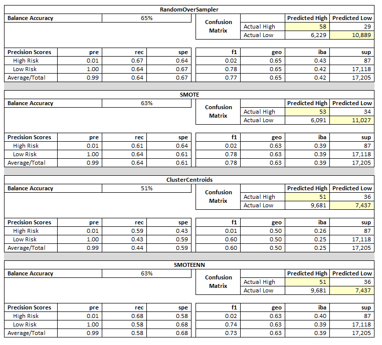
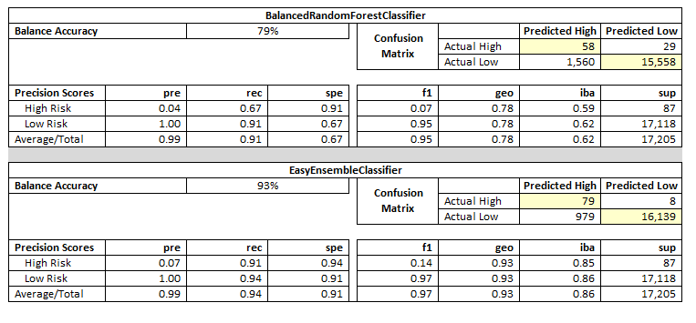

# Credit Risk Analysis - Supervised Machine Learning

## Overview
 Fast Lending, a peer to peer lending services company wants to use machine learning to predict credit risk.  The leaders believe that this will provide a quicker and more reliable loan experience.  The assumption is that supervised machine learning will lead to a more accurate indentification of good candidates for loans and further lead to lower default rates.  
 
 We were asked to build and evaluate several models, or algorithims, to predict credit risk.  The process used sampling and ensemble learners to ensure accuracy of the analysis.  The models also included a large set of data where that should assist in quickly making a single decision, approval or denial of the requested loan.  
 
 The analysis includes several different models using them to compare the strengths and weaknesses of the models.  Python and Sciket-learn werea utilized in the process to build and evaluate the data and predict credit risk.  
 
## Results
A very large data set was utilized to create the machine learning tool.  The data was first divided into a training and testing set so that we are able to test the accuracy of the model.  Once the data was split three sampling models were used to analyze the data:
* Oversample the data using the RandomOverSampler and SMOTE algorithms.
* Undersample the data using the ClusterCentroids algorithm.
* Over/Undersampling using the SMOTEENN algorithm.
* Compare two machine learning models that reduce bias, BalancedRandomForestClassifier and EasyEnsembleClassifier.

*Resampling*

* Balance Accuracy Score  for all three models is low ranging from 51% to 65%.

* The Confusion Matrix for the ClusterCentroids and SMOTEENN models were more accurate than the RandomOverSampler and SMOTE models with accurate results of 9,681.  The results for high risk customers was comparable across all four models with ~50 that were predicted to be high risk and were.

* Across all models are the same with a precision score for high risk customers at 1% and low risk customers at 100%.  This is interesting when comparing to the f1 score as the models are all comparable to each other except for ClusterCentroids.  The low risk customers are at 60% on the CLusterCentroids with the other models are 70%+ range.   

*Ensemble*

* The Balance Accuracy scores for the ensemble models are higher than the resampling at 78% for the BalancedRandomForestClassifier and 92% for the EasyEnsembleClassifier.
* The Confusion Matrix results for the ensemble models are not comparable to the other models or each other.  The accuracy of the BalancedRandomForestClassifier is very low with 58 for the high risk customers and 1,560 for the low risk customers. The accuracy for the EasyEnsembleClassifier has mixed results with high accuracy for high risk customers and low accuracy for low risk customers.
* The Precision Scores for these models are similar to the other models; however, a little better for the high risk loans.  The f1 scores for these models is better with an average of 95% and 97%, respectively.

## Summary
: Summarize the results of the machine learning models, and include a recommendation on the model to use, if any. If you do not recommend any of the models, justify your reasoning.

There is a recommendation on which model to use, or there is no recommendation with a justification